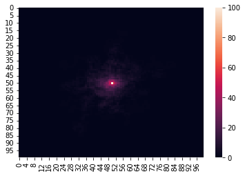

## SAW (self-avoiding walk) Python implementation
A Self-Avoiding Random Walk (SARW) is a mathematical concept involving a path on a grid or lattice that never crosses its own track — in graphical terms, it is a path without loops.[Further reading](https://en.wikipedia.org/wiki/Self-avoiding_walk)
## Uses
- Risk Management
- Derivatives Pricing
- Investment Strategy Development
- Economic Forecasting

## Installation

Open & run SARW.ipynb with [Jupyter](https://jupyter.org/) 

### Set the parameters:
```saw(simulations,size)```
- Simulations: the number of times to run the SARW simulation
- Size: the (2D) size of the area to be navigated. i.e., a size of 100 means 10,000 potential positions

- Returns: position_visits:
    -   dict object indexing the number of simulations that encountered the specific location by (x,y) position tuples 
### See below for a sample run of 100 simulations in a 100x100 grid, visualized by a heatmap (via [Seaborn](https://seaborn.pydata.org/tutorial/introduction))
```python
position_visits,simulations, size = saw(100, 100)
visits_2d = [[0 for _ in range(size)] for _ in range(size)]
for (x, y), visits in position_visits.items():
    visits_2d[x][y] = visits
visits_array = np.array(visits_2d)

sns.heatmap(visits_array)
```
Failures: 100 | Total Steps: 6950 | Average Steps: 69.5
    

    
## Contact

[LinkedIn]

[LinkedIn]: <https://www.linkedin.com/in/luke-mcdonald-usask/>
